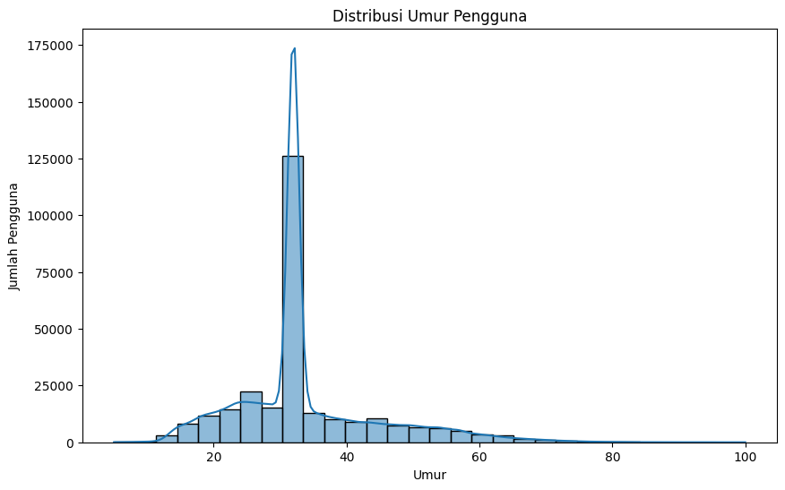
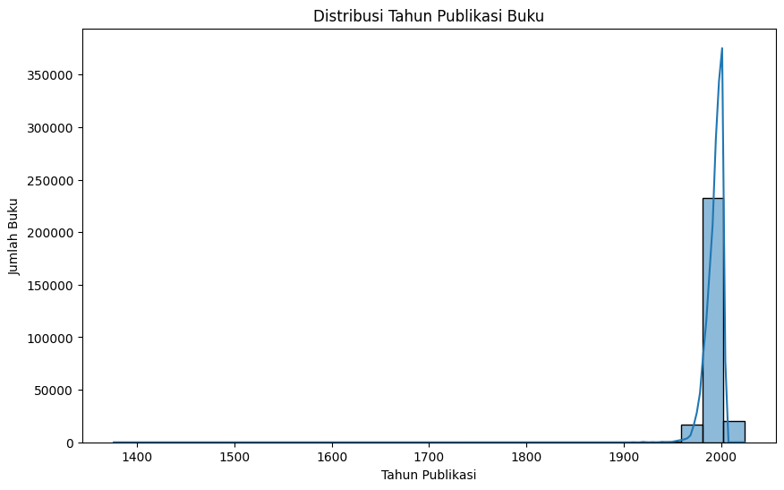
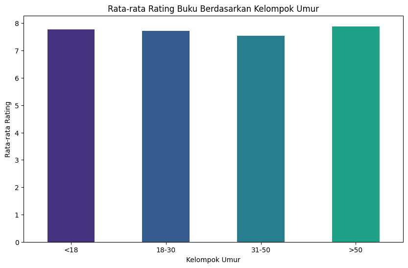
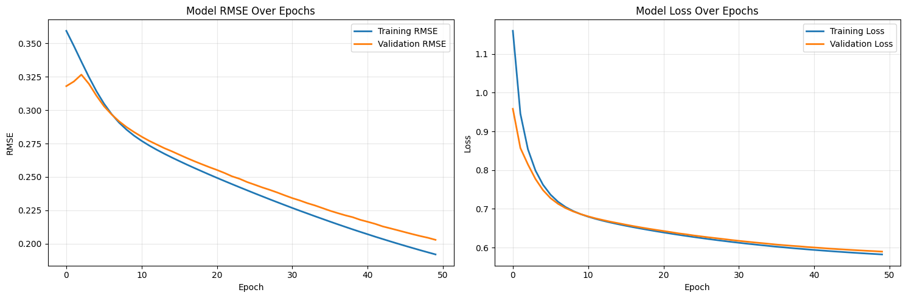

# **Laporan Proyek Machine Learning - Muhammad Hasan Fadhlillah**

## **Project Overview**

Dunia literasi digital dipenuhi dengan jutaan judul buku yang tersedia di berbagai platform. Menurut laporan dari WordsRated, terdapat lebih dari 2.7 juta buku baru yang diterbitkan setiap tahunnya di seluruh dunia. Banjir informasi ini, meskipun positif, seringkali menimbulkan _information overload_ bagi pembaca. Pembaca, terutama yang kasual, mengalami kesulitan dalam menemukan buku baru yang sesuai dengan selera dan preferensi mereka di antara lautan pilihan yang ada. Tanpa arahan yang tepat, banyak pembaca akhirnya kembali ke buku atau penulis yang sudah mereka kenal, sehingga melewatkan banyak karya berkualitas lainnya.

Masalah ini tidak hanya merugikan pembaca, tetapi juga penulis dan penerbit. Buku-buku "hidden gems" atau karya dari penulis baru sulit mendapatkan visibilitas yang layak karena tertutup oleh judul-judul yang sudah populer. Platform penjualan buku digital seperti Amazon dan Goodreads sangat bergantung pada efektivitas sistem rekomendasi untuk meningkatkan pengalaman pengguna, mendorong penemuan buku baru, dan pada akhirnya meningkatkan penjualan. Sebuah sistem rekomendasi yang efektif dapat secara signifikan meningkatkan keterlibatan (_engagement_) pengguna dan loyalitas terhadap platform.

Proyek ini bertujuan untuk membangun sebuah sistem rekomendasi buku yang dapat mengatasi masalah tersebut dengan menyediakan rekomendasi yang dipersonalisasi kepada pengguna, menggunakan dua pendekatan utama: _Content-Based Filtering_ dan _Collaborative Filtering_.

### **Referensi**

[1] Ziegler, C. N., McNee, S. M., Konstan, J. A., & Lausen, G. (2005). Improving recommendation lists through topic diversification. In _Proceedings of the 14th international conference on World Wide Web (WWW '05)_. Association for Computing Machinery, New York, NY, USA, 22–32. DOI: [https://doi.org/10.1145/1060745.1060754](https://doi.org/10.1145/1060745.1060754)

---

## **Business Understanding**

### **Problem Statements**

Berdasarkan latar belakang yang telah diuraikan, rincian permasalahan yang akan diselesaikan adalah:

- Bagaimana cara memberikan rekomendasi buku yang relevan kepada pengguna berdasarkan buku yang pernah mereka sukai sebelumnya (berdasarkan kemiripan konten)?
- Bagaimana cara membantu pengguna menemukan buku-buku baru yang mungkin mereka sukai, berdasarkan pola baca dari pengguna lain dengan selera yang serupa?

### **Goals**

Untuk menjawab permasalahan tersebut, proyek ini memiliki tujuan sebagai berikut:

- Membangun model rekomendasi yang mampu menghasilkan daftar buku serupa berdasarkan kemiripan atributnya (misalnya, penulis).
- Mengembangkan model rekomendasi yang dapat memprediksi preferensi pengguna terhadap buku yang belum pernah mereka baca, berdasarkan riwayat rating pengguna lain.

### **Solution Approach**

Untuk mencapai tujuan tersebut, diajukan dua pendekatan solusi:

1.  **Content-Based Filtering:**
    Pendekatan ini akan merekomendasikan buku dengan cara menganalisis kemiripan fitur atau "konten" dari buku itu sendiri. Dalam proyek ini, fitur yang digunakan adalah **penulis buku (Book-Author)**. Model akan menghitung kemiripan antar buku berdasarkan penulisnya dan menyarankan buku lain dari penulis yang sama atau serupa. Pendekatan ini berguna untuk mengatasi masalah _item cold-start_ (buku baru).
2.  **Collaborative Filtering:**
    Pendekatan ini akan merekomendasikan buku dengan mengidentifikasi pengguna lain yang memiliki selera serupa. Model akan menganalisis matriks interaksi pengguna-buku (rating) untuk menemukan pola. Jika Pengguna A dan Pengguna B menyukai buku-buku yang sama, maka buku lain yang disukai oleh Pengguna B (namun belum dibaca Pengguna A) akan direkomendasikan. Pendekatan ini diimplementasikan menggunakan teknik _deep learning_ (Matrix Factorization dengan Embedding) untuk menangkap pola preferensi yang kompleks dan implisit.

---

## **Data Understanding**

Dataset yang digunakan dalam proyek ini adalah **Book-Crossings**, yang merupakan kumpulan data anonim dari komunitas buku online. Dataset ini terdiri dari tiga file CSV terpisah yang berisi informasi mengenai pengguna, buku, dan rating yang diberikan.

- **Sumber Dataset:** [Book-Crossings Dataset](https://www.google.com/search?q=http://www2.informatik.uni-freiburg.de/~cziegler/BX/)

Setelah dimuat, dataset ini terdiri dari tiga DataFrame:

- **`books`**: Berisi 271,360 entri data metadata buku.
- **`users`**: Berisi 278,858 entri data demografi pengguna.
- **`ratings`**: Berisi 1,149,780 entri data interaksi rating pengguna-buku.

Inspeksi awal menunjukkan bahwa data interaksi (`ratings`) dalam kondisi sangat baik tanpa nilai yang hilang. Namun, data `users` memiliki masalah signifikan dengan **110,762 nilai kosong (\~40%)** pada kolom `Age`, dan data `books` memiliki tipe data yang salah pada kolom `Year-Of-Publication` (seharusnya numerik). Masalah ini akan ditangani pada tahap Data Preparation.

### **Deskripsi Variabel**

Variabel-variabel pada dataset ini adalah sebagai berikut:

- **Pada `Books.csv`**:
  - `ISBN`: Kode unik internasional untuk setiap buku.
  - `Book-Title`: Judul dari buku.
  - `Book-Author`: Penulis dari buku.
  - `Year-Of-Publication`: Tahun buku diterbitkan.
  - `Publisher`: Penerbit buku.
  - `Image-URL-S/M/L`: Tautan URL ke gambar sampul buku dalam berbagai ukuran.
- **Pada `Users.csv`**:
  - `User-ID`: ID unik untuk setiap pengguna.
  - `Location`: Lokasi (kota, negara) dari pengguna.
  - `Age`: Umur dari pengguna.
- **Pada `Ratings.csv`**:
  - `User-ID`: ID unik pengguna yang memberikan rating.
  - `ISBN`: ID unik buku yang diberi rating.
  - `Book-Rating`: Nilai rating yang diberikan, dengan skala dari 1 hingga 10 untuk rating eksplisit, dan 0 untuk rating implisit.

### **Exploratory Data Analysis (EDA)**

Untuk memahami data lebih dalam, dilakukan beberapa visualisasi:

**1. Distribusi Umur Pengguna**

_Gambar 1: Distribusi Umur Pengguna Setelah Imputasi._

Grafik di atas menunjukkan distribusi umur pengguna setelah proses pembersihan data. Terdapat puncak yang sangat tinggi di sekitar usia 34 tahun, yang merupakan efek dari pengisian nilai kosong dengan median. Di luar itu, mayoritas pengguna berada di rentang usia dewasa muda (20-40 tahun).

**2. Distribusi Tahun Publikasi Buku**

_Gambar 2: Distribusi Tahun Publikasi Buku._

Distribusi ini sangat condong ke kanan (_right-skewed_), menunjukkan bahwa mayoritas buku dalam dataset diterbitkan di era modern (1990-2000an). Ini mengindikasikan model akan lebih andal untuk buku-buku kontemporer.

**3. Rata-rata Rating Berdasarkan Kelompok Umur**

_Gambar 3: Rata-rata Rating Eksplisit per Kelompok Umur._

Grafik ini menunjukkan bahwa tidak ada perbedaan drastis dalam cara memberikan rating antar kelompok umur, dengan semua kelompok memberikan rata-rata rating di atas 7.5 (dari skala 10). Ini menandakan preferensi kualitas relatif konsisten.

---

## **Data Preparation**

Tahapan persiapan data dilakukan untuk memastikan data bersih, konsisten, dan siap untuk pemodelan. Berikut adalah proses yang dilakukan secara berurutan:

1.  **Data Cleaning & Preprocessing**:

    - **Penanganan `Year-Of-Publication`**:
      - **Proses**: Kolom ini diubah menjadi tipe numerik menggunakan `pd.to_numeric(errors='coerce')`, yang secara otomatis mengubah entri non-numerik menjadi `NaN`. Nilai tahun yang tidak valid (0 atau di masa depan) juga diubah menjadi `NaN`. Nilai-nilai `NaN` yang dihasilkan kemudian diisi dengan **median** dari tahun publikasi yang valid.
      - **Alasan**: Kolom tahun harus berjenis numerik agar dapat diolah secara matematis (misalnya, untuk mencari median atau digunakan sebagai fitur). Menggunakan median untuk imputasi dipilih karena lebih robust (tahan) terhadap nilai ekstrem dibandingkan rata-rata, sehingga tidak menggeser distribusi data secara signifikan.
    - **Penanganan `Age`**:
      - **Proses**: Umur yang tidak realistis (\< 5 atau \> 100) diidentifikasi dan diubah menjadi `NaN`. Kemudian, semua nilai `NaN` (termasuk 110.762 nilai kosong awal) diisi dengan **median** umur pengguna.
      - **Alasan**: Validasi data penting untuk menjaga kualitas dan logika model. Imputasi dengan median adalah strategi yang jauh lebih baik daripada menghapus \~40% data pengguna, yang akan sangat merugikan performa model Collaborative Filtering yang bergantung pada banyaknya data interaksi.
    - **Penanganan `Publisher` dan `Book-Author`**:
      - **Proses**: Nilai kosong yang sangat sedikit pada kolom ini diisi dengan string placeholder `"Unknown"`.
      - **Alasan**: Ini adalah cara sederhana dan efektif untuk menangani data kategorikal yang hilang dalam jumlah kecil tanpa harus kehilangan seluruh baris data, yang mana data ratingnya masih berharga.

2.  **Penggabungan dan Finalisasi Data**:

    - **Proses**: DataFrame `ratings` dan `books` digabungkan menjadi satu DataFrame final (`df_final`) menggunakan `pd.merge` berdasarkan `ISBN`. Setelah itu, dilakukan penghapusan duplikat berdasarkan interaksi `User-ID` dan `Book-Title`, serta penghapusan baris dengan `Book-Title` atau `Book-Author` yang kosong.
    - **Alasan**: Penggabungan diperlukan untuk menyatukan data interaksi (rating) dengan metadata item (judul, penulis) dalam satu tempat. Ini penting karena kedua model membutuhkan kombinasi data ini. Deduplikasi memastikan setiap interaksi pengguna-buku bersifat unik untuk menjaga integritas data, dan penghapusan `NaN` pada fitur kunci mencegah error pada saat pemodelan.

3.  **Persiapan Data untuk Collaborative Filtering**:

    - **Filtering**: Dataset difilter untuk hanya menyertakan pengguna dengan \>10 rating dan buku dengan \>5 rating. Rating implisit (nilai 0) juga dihapus. Langkah ini menghasilkan **168,507** interaksi berkualitas tinggi.
      - **Alasan**: Langkah ini sangat penting untuk mengurangi masalah _sparsity_ (data yang kosong) dan _noise_. Dengan fokus pada pengguna aktif dan buku yang cukup dikenal, model dapat belajar dari pola preferensi yang lebih kuat dan stabil.
    - **Encoding**: `User-ID` dan `ISBN` diubah menjadi indeks integer yang berurutan.
      - **Alasan**: Model _deep learning_, khususnya Embedding Layer di Keras/TensorFlow, memerlukan input berupa indeks integer yang berurutan sebagai kategori, bukan ID asli yang acak.
    - **Normalisasi**: `Book-Rating` (skala 1-10) dinormalisasi ke rentang [0, 1] menggunakan _Min-Max Scaling_.
      - **Alasan**: Menyamakan skala variabel target (rating) ke rentang yang kecil (0-1) membantu proses training model agar lebih stabil dan konvergen lebih cepat. Ini adalah praktik standar dalam jaringan saraf tiruan.
    - **Splitting**: Data dibagi menjadi 80% data latih dan 20% data validasi.
      - **Alasan**: Ini adalah langkah fundamental dalam machine learning untuk mengevaluasi kinerja model secara objektif pada data yang belum pernah dilihat sebelumnya, memastikan model tidak _overfitting_.

---

## **Modeling**

Pada tahap ini, dikembangkan dua model sistem rekomendasi yang berbeda untuk menyelesaikan permasalahan.

### **Solusi 1: Content-Based Filtering**

**Cara Kerja & Konteks Proyek:**
Model ini bekerja berdasarkan prinsip "pengguna akan menyukai item yang mirip dengan item yang mereka sukai di masa lalu". Dalam konteks proyek ini, kemiripan didefinisikan berdasarkan **penulis buku**. Prosesnya adalah sebagai berikut:

1. Setiap buku direpresentasikan sebagai sebuah vektor berdasarkan penulisnya menggunakan TF-IDF. TF-IDF memberikan bobot yang lebih tinggi kepada penulis yang lebih jarang muncul di seluruh dataset, menganggapnya sebagai fitur yang lebih distingtif.
2. Ketika pengguna memilih sebuah buku, vektor buku tersebut akan dibandingkan dengan vektor semua buku lainnya menggunakan metrik _Cosine Similarity_.
3. _Cosine Similarity_ mengukur sudut kosinus antara dua vektor, yang efektif untuk menentukan kemiripan orientasi (dalam hal ini, kesamaan penulis) tanpa terpengaruh oleh panjang vektor.
4. Buku-buku dengan skor kemiripan tertinggi akan direkomendasikan.

_Potongan kode penting:_

```python
# Inisialisasi dan fitting TF-IDF
tf_idf = TfidfVectorizer(max_features=5000)
tfidf_matrix = tf_idf.fit_transform(books_for_content['Book-Author'].fillna(''))
# Hitung cosine similarity (on-the-fly)
sim_scores = cosine_similarity(book_vector, tfidf_matrix).flatten()
```

**Kelebihan dan Kekurangan:**

- **Kelebihan**:
  - Tidak memerlukan data pengguna lain.
  - Dapat merekomendasikan item baru (_item cold-start_) selama fiturnya tersedia.
  - Rekomendasi mudah dijelaskan (misalnya, "direkomendasikan karena penulisnya sama").
- **Kekurangan**:
  - **Terbatas pada konten**: Model ini hanya merekomendasikan buku berdasarkan penulis yang sama atau mirip dan tidak dapat menemukan rekomendasi lintas genre atau tema (_serendipity_ rendah).
  - Cenderung menghasilkan rekomendasi yang terlalu mirip atau jelas (_overspecialization_).
  - Memerlukan fitur yang kaya dan terstruktur untuk bisa menghasilkan rekomendasi yang beragam.

**Top-N Recommendation Output:**
Berikut adalah contoh 10 rekomendasi buku teratas untuk buku _"The Hobbit"_.

|     | Similarity_Score | Book-Title                                                                                        | Book-Author      |
| --: | ---------------: | :------------------------------------------------------------------------------------------------ | :--------------- |
|   0 |           1.0000 | The Lord of the Rings : The Two Towers and the Return of the King(Exerpts)                        | J.R.R. Tolkien   |
|   1 |           1.0000 | Beowulf: The Monster and the Critics                                                              | J. R. R. Tolkien |
|   2 |           1.0000 | Histoire de la terre du milieu, tome 1 : Le Livre des contes perdus                               | J.R.R. Tolkien   |
|   3 |           1.0000 | The Book of Lost Tales, Part Two (The History of Middle-Earth - Volume 2)                         | J. R. R. Tolkien |
|   4 |           1.0000 | La Silmarillon                                                                                    | J. R. R. Tolkien |
|   5 |           1.0000 | The English Text of the Ancrene Riwle : Ancrene Wisse, Corpus Christi College Cambridge MS 402... | J R R Tolkien    |
|   6 |           1.0000 | Old English Exodus                                                                                | J. R. R. Tolkien |
|   7 |           1.0000 | The Two Towers (Lord of the Rings (Paperback))                                                    | J. R. R. Tolkien |
|   8 |           1.0000 | Smith of Wootton Major                                                                            | J. R. R. Tolkien |
|   9 |           1.0000 | The Fellowship of the Ring (Lord of the Rings (Paperback))                                        | J. R. R. Tolkien |

_Tabel 1: Contoh Rekomendasi Content-Based Filtering._

### **Solusi 2: Collaborative Filtering dengan Deep Learning**

**Cara Kerja & Konteks Proyek:**
Model ini bekerja berdasarkan prinsip "pengguna yang setuju di masa lalu cenderung akan setuju di masa depan". Dalam konteks proyek ini:

1. Model mempelajari representasi tersembunyi (vektor _embedding_) untuk setiap pengguna dan setiap buku dari matriks rating historis. Vektor ini menangkap "selera" pengguna dan "karakteristik" buku secara implisit.
2. Untuk memprediksi rating, model mengambil vektor _embedding_ dari seorang pengguna dan sebuah buku, lalu menghitung _dot product_ di antara keduanya. Hasilnya merepresentasikan seberapa cocok pengguna tersebut dengan buku tersebut.
3. Dengan menggunakan arsitektur _deep learning_, model ini dapat menangkap interaksi yang lebih kompleks dan non-linear dibandingkan _Matrix Factorization_ tradisional, sehingga menghasilkan prediksi yang lebih akurat.
4. Rekomendasi diberikan dengan memprediksi rating untuk semua buku yang belum dibaca oleh pengguna, lalu mengurutkannya dari yang tertinggi.

**Kelebihan dan Kekurangan:**

- **Kelebihan**:
  - **Serendipity Tinggi**: Mampu menemukan item baru yang relevan namun tak terduga bagi pengguna.
  - Tidak memerlukan fitur item yang eksplisit; model belajar dari perilaku pengguna.
- **Kekurangan**:
  - **Cold-Start Problem**: Kesulitan merekomendasikan item baru yang belum memiliki rating atau untuk pengguna baru yang belum memberikan rating.
  - Membutuhkan data interaksi yang banyak dan seringkali menderita masalah _sparsity_ (matriks rating yang sangat kosong).
  - Rekomendasi lebih sulit diinterpretasikan (bersifat _black box_).

**Arsitektur & Parameter Model `RecommenderNet`:**
_Potongan kode penting:_

```python
class RecommenderNet(tf.keras.Model):
    def __init__(self, num_users, num_books, embedding_size=6, dropout_rate=0.7):
        # ... Embedding layers for users and books (embedding_size=6)
        # ... Bias layers for users and books
        # ... Dropout(0.7), Dropout(0.56), Dropout(0.42)
        # ... BatchNormalization()
        # ... Dense(3, activation='relu')

    def call(self, inputs, training=None):
        # ... forward pass logic ...
        return tf.nn.sigmoid(x)

model.compile(
    loss=tf.keras.losses.BinaryCrossentropy(label_smoothing=0.1),
    optimizer=keras.optimizers.Adam(learning_rate=0.00005, weight_decay=5e-4, clipnorm=1.0),
    metrics=[tf.keras.metrics.RootMeanSquaredError()]
)
```

**Top-N Recommendation Output:**

Berikut adalah contoh 10 rekomendasi teratas untuk `User ID: 505`.

**Buku yang pernah diberi rating tinggi oleh User 505:**

|     | Book-Title                                        | Book-Rating |
| --: | :------------------------------------------------ | ----------: |
|   0 | The Night Listener                                |           9 |
|   1 | Organizing from the Inside Out                    |           9 |
|   2 | Vanished                                          |           8 |
|   3 | Not a Day Goes By : A Novel                       |           8 |
|   4 | And Never Let Her Go : Thomas Capano: The Dead... |           8 |

_Tabel 2: Riwayat Rating User 505 sebagai Konteks Rekomendasi._

**Top 10 Rekomendasi Buku:**

|     | Book-Title                                             | Book-Author        | Predicted_Rating |
| --: | :----------------------------------------------------- | :----------------- | ---------------: |
|   0 | The Return of the King (The Lord of the Rings, Part 3) | J.R.R. TOLKIEN     |           0.7825 |
|   1 | Harry Potter and the Chamber of Secrets Postcard Book  | J. K. Rowling      |           0.7801 |
|   2 | My Sister's Keeper : A Novel (Picoult, Jodi)           | Jodi Picoult       |           0.7741 |
|   3 | Harry Potter and the Goblet of Fire (Book 4)           | J. K. Rowling      |           0.7738 |
|   4 | Dilbert: A Book of Postcards                           | Scott Adams        |           0.7738 |
|   5 | The Time Traveler's Wife                               | Audrey Niffenegger |           0.7734 |
|   6 | To Kill a Mockingbird                                  | Harper Lee         |           0.7688 |
|   7 | The Two Towers (The Lord of the Rings, Part 2)         | J. R. R. Tolkien   |           0.7665 |
|   8 | Harry Potter and the Order of the Phoenix (Book 5)     | J. K. Rowling      |           0.7646 |
|   9 | East of Eden (Oprah's Book Club)                       | John Steinbeck     |           0.7634 |

_Tabel 3: Contoh Rekomendasi Collaborative Filtering untuk User 505._

_Tabel 3: Contoh Rekomendasi Collaborative Filtering untuk User 505._

### **Perbandingan Solusi**

| Kriteria                 | Content-Based Filtering | Collaborative Filtering  |
| :----------------------- | :---------------------- | :----------------------- |
| **Data yang Dibutuhkan** | Atribut/Metadata Item   | Data Interaksi User-Item |
| **Serendipity**          | Rendah                  | Tinggi                   |
| **Cold-Start Problem**   | Mengatasi (item baru)   | Menderita (user & item)  |
| **Kompleksitas**         | Rendah-Sedang           | Tinggi                   |
| **Interpretasi**         | Mudah                   | Sulit                    |

_Tabel 4: Perbandingan antara Model Content-Based dan Collaborative Filtering._

Kedua model memiliki peran yang saling melengkapi. **Content-Based Filtering** sangat baik untuk memberikan rekomendasi yang aman dan dapat dijelaskan, terutama untuk item-item baru. Namun, kekuatannya terbatas pada fitur yang ada. Di sisi lain, **Collaborative Filtering** unggul dalam personalisasi dan penemuan (serendipity) karena mampu menangkap selera yang lebih abstrak dari interaksi pengguna. Meskipun lebih kompleks dan menderita masalah _cold-start_, kemampuannya untuk merekomendasikan item lintas genre yang relevan menjadikannya solusi yang lebih kuat untuk meningkatkan keterlibatan pengguna dalam jangka panjang. Untuk sistem rekomendasi yang komprehensif, pendekatan _hybrid_ yang menggabungkan keduanya seringkali menjadi solusi terbaik.

---

## **Evaluation**

### **Metrik Evaluasi: Root Mean Squared Error (RMSE)**

- **Definisi**: RMSE adalah metrik standar yang digunakan untuk mengukur rata-rata magnitudo kesalahan antara nilai yang diprediksi oleh model dan nilai aktual. Metrik ini digunakan untuk masalah regresi, termasuk prediksi rating.
- **Formula**:
  $$RMSE = \sqrt{\frac{1}{n}\sum_{i=1}^{n}(y_i - \hat{y}_i)^2}$$
  di mana:
  - $n$ adalah jumlah total data rating.
  - $y\_i$ adalah rating aktual yang diberikan oleh pengguna.
  - $\\hat{y}\_i$ adalah rating yang diprediksi oleh model.
- **Cara Kerja**: RMSE menghitung selisih antara prediksi dan nilai sebenarnya untuk setiap titik data, mengkuadratkan selisih tersebut (memberi "hukuman" lebih pada kesalahan besar), merata-ratakannya, lalu mengambil akar kuadrat untuk mengembalikan satuan kesalahan ke satuan asli variabel target.
- **Konteks dalam Proyek**: Dalam proyek ini, RMSE digunakan untuk mengevaluasi seberapa akurat model _Collaborative Filtering_ dalam memprediksi rating buku (pada skala yang telah dinormalisasi [0, 1]). Nilai RMSE yang lebih rendah menunjukkan bahwa prediksi model lebih dekat dengan rating asli yang diberikan pengguna, menandakan performa yang lebih baik.

### **Hasil Pelatihan & Evaluasi**

Proses pelatihan dikontrol menggunakan _callbacks_ `EarlyStopping` dan `ReduceLROnPlateau` untuk efisiensi.


_Gambar 4: Kurva Pembelajaran Model (RMSE dan Loss) Selama Training._

Dari kurva di atas, terlihat bahwa nilai RMSE dan Loss untuk data latih dan data validasi menurun secara konsisten dan berjalan beriringan. Ini menandakan bahwa model _well-fit_ dan tidak mengalami _underfitting_ maupun _overfitting_ yang signifikan.

Hasil metrik akhir model disajikan dalam tabel berikut:

| Metrik              | Nilai      |
| :------------------ | :--------- |
| Training RMSE       | 0.1920     |
| **Validation RMSE** | **0.2028** |
| Gap (Val - Train)   | 0.0108     |

_Tabel 5: Hasil Akhir Metrik Model Collaborative Filtering._

**Interpretasi Hasil:**

- Model mencapai **Validation RMSE sebesar 0.2028** pada data yang belum pernah dilihat sebelumnya. Nilai ini berada pada skala rating yang telah dinormalisasi [0, 1], yang berarti rata-rata kesalahan prediksi model sangat kecil.
- Selisih (_gap_) antara `Validation RMSE` dan `Training RMSE` hanya **0.0108**, yang mengonfirmasi bahwa model memiliki **kemampuan generalisasi yang sangat baik** dan tidak _overfit_.
- Analisis statistik prediksi pada data validasi menunjukkan bahwa model menghasilkan output yang wajar dan stabil (rata-rata prediksi: 0.6460, std: 0.0803).

Kesimpulannya, model _Collaborative Filtering_ yang dibangun sangat akurat dan andal, menjadikannya solusi yang efektif untuk memberikan rekomendasi buku yang dipersonalisasi dan berkualitas tinggi.
