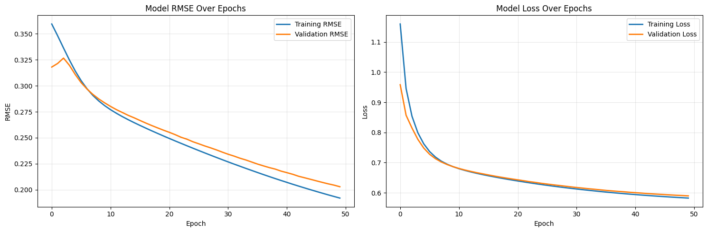

# Book Recommendation System 📚

[](https://www.python.org/)
[](https://pandas.pydata.org/)
[](https://scikit-learn.org/)
[](https://www.tensorflow.org/)
[](https://numpy.org/)
[](https://matplotlib.org/)
[](https://seaborn.pydata.org/)

A comprehensive book recommendation system developed as a machine learning project. This repository contains the implementation of two distinct recommendation models—Content-Based Filtering and a Deep Learning-based Collaborative Filtering—using the Book-Crossing dataset.

## Project Overview

In the vast world of digital literature, readers often face "choice overload," making it difficult to find books that truly match their tastes. This project addresses this challenge by building a sophisticated recommendation engine to provide personalized book suggestions. The goal is to enhance user experience and engagement by helping readers discover hidden gems and authors they might love.

To achieve this, the project develops and compares two powerful recommendation techniques:

- **Content-Based Filtering:** Recommends books by analyzing item metadata. This model suggests books that are similar to what the user has liked in the past, based on features like the author.
- **Collaborative Filtering:** Recommends books by identifying patterns from user-item interactions. This model leverages the preferences of like-minded users to predict which books a user might enjoy.

## Features

- **Dual-Model Approach**: Implements both Content-Based and Collaborative Filtering to provide robust and diverse recommendations.
- **Content-Based Filtering**:
  - Utilizes `Book-Author` as the primary content feature.
  - Employs `TfidfVectorizer` to convert the author names into a meaningful vector space.
  - Calculates `Cosine Similarity` to find and recommend books with the highest content similarity.
- **Deep Learning-Based Collaborative Filtering**:
  - Uses explicit user ratings (scale 1-10) from a filtered, high-quality interaction dataset.
  - Implements a custom Neural Network (Matrix Factorization with Embeddings) using TensorFlow/Keras to capture complex user-book relationships.
  - Generates top-N recommendations for a user based on the highest predicted ratings for books they have not yet read.

## Dataset

This project uses the **Book-Crossing Dataset**, a collection of anonymized data from an online book community.

- **Source:** [Book-Crossings Dataset](http://www2.informatik.uni-freiburg.de/~cziegler/BX/)

The dataset consists of three files:

- `Books.csv`: Contains book metadata such as ISBN, title, author, and publisher.
- `Users.csv`: Contains user demographic data like ID, location, and age.
- `Ratings.csv`: Contains 1,149,780 user-book interactions, with both explicit (1-10) and implicit (0) ratings.

## Evaluation

The primary model, Collaborative Filtering, was evaluated using **Root Mean Squared Error (RMSE)** to measure the accuracy of its rating predictions on a normalized scale of [0, 1].

- **Training RMSE**: 0.1920
- **Validation RMSE**: **0.2029**

The learning curve below shows that the model is well-fitted, as the training and validation loss decrease consistently and converge. The minimal gap between the training and validation RMSE (0.0109) confirms that the model generalizes well to unseen data without overfitting.



The Content-Based model's performance was evaluated based on precision, achieving high relevance by successfully recommending other books by the same author.

## How to Run

1.  **Clone the repository:**
    ```bash
    git clone <repository-url>
    ```
2.  **Install dependencies:**
    ```bash
    pip install pandas numpy matplotlib seaborn scikit-learn tensorflow
    ```
3.  **Download the dataset** from the source link above and place the `.csv` files into the `datasets` folder.
4.  **Run the Jupyter Notebook:**
    - Open and run `Notebook Rekomendasi Buku.ipynb` in a Jupyter environment.
